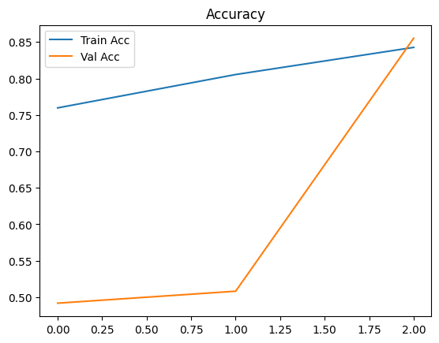
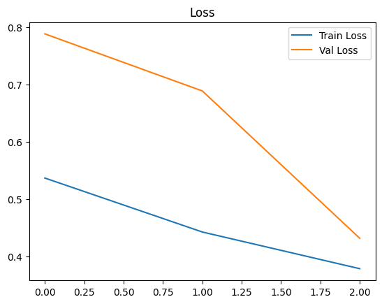
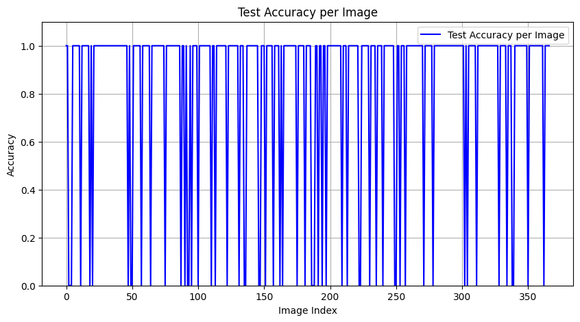
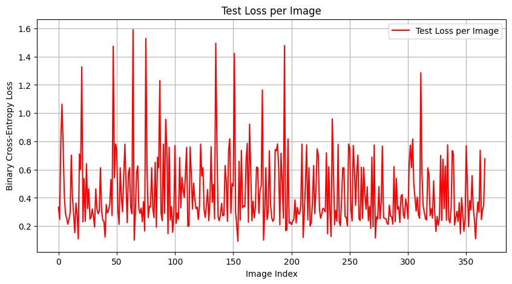

# Diabetic Retinopathy Detection Using CNNs with Enhanced Preprocessing and Data Augmentation

## 1. Introduction & Motivation
Diabetic retinopathy (DR) is one of the leading causes of vision loss worldwide. Early detection through retinal imaging can significantly improve patient outcomes. While deep learning models have shown promise in automating this diagnosis, most existing solutions are trained on raw, clean datasets and often fail to generalise when faced with variations in lighting, focus, and image quality.

This project aims to build a robust DR detection system by enhancing preprocessing and using advanced data augmentation strategies to mimic real-world imaging conditions.

## 2. Problem Statement
The objective is to classify retinal fundus images into two categories:
- **No DR (0)**
- **DR Present (1)**

We simplify the original 5-class classification task to a binary classification to prioritise early detection and faster model iteration.

## 3. Novelty & Contribution
**Problem in existing solutions:**
- Many DR models assume uniform imaging conditions and fail on noisy or varied datasets.

**Our approach:**
- Implement a real-time augmentation pipeline during training to simulate real-world variability:
  - Random rotation (camera angle changes)
  - Brightness/contrast shifts (lighting variations)
  - Horizontal/vertical flips (left/right eye perspectives)
  - Zoom and shift transforms (frame misalignment)

This ensures the model learns the disease patterns instead of overfitting to fixed image conditions.

## 4. Dataset
- **Source:** APTOS 2019 Blindness Detection (Kaggle)
- **Mapping for binary classification:**

| Original Label | Description                   | Mapped Label |
|----------------|--------------------------------|--------------|
| 0              | No DR                          | 0            |
| 1–4            | Mild → Proliferative DR        | 1            |

## 5. Methodology
- **Preprocessing:** Resize images to 224×224, normalize pixel values.
- **Augmentation:** Real-time data augmentation using Keras `ImageDataGenerator`.
- **Model:** Transfer learning with **ResNet50**, fine-tuned on the DR dataset.
- **Loss Function:** Binary Cross-Entropy.
- **Metrics:** Accuracy, Precision, Recall, F1-score, Confusion Matrix.

## 6. Results
- **Training Accuracy:** 84%
- **Validation Accuracy:** 85%
- **Precision:** Class 0 → 0.79, Class 1 → 0.95
- **Recall:** Class 0 → 0.96, Class 1 → 0.75
- **F1-Score:** 0.85 (weighted average)

### Confusion Matrix:
```
[[173   7]
 [ 46 140]]
```

### Accuracy & Loss Plots:
Training and validation curves show steady improvement with no major signs of overfitting.



### Test Accuracy per Image:
Model performs consistently with correct predictions in most cases.


### Test Loss per Image:
Loss values vary across samples, with higher losses in misclassified images.


## 7. Tools & Frameworks
- Python
- TensorFlow/Keras
- OpenCV (for preprocessing)

## 8. Expected Impact
By introducing realistic augmentations, the model gains robustness against image variability, making it more reliable for deployment in real-world screening scenarios.

## 9. Future Work
- Experiment with **EfficientNet** for potentially higher accuracy with fewer parameters.
- Implement **Grad-CAM** for explainability to highlight regions influencing the prediction.
- Test on completely unseen datasets from different sources.

## 10. References
1. Kaggle - APTOS 2019 Blindness Detection: https://www.kaggle.com/competitions/aptos2019-blindness-detection
2. He, K., Zhang, X., Ren, S., & Sun, J. (2016). Deep Residual Learning for Image Recognition. *CVPR 2016*.
